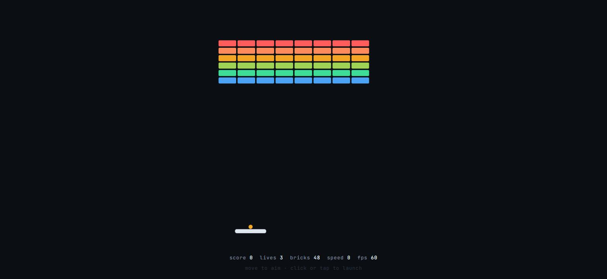

# Swept Breakout

**[Play it →](https://mikedavisrocha.github.io/swept-breakout/)**



A breakout in **Pixi.js v8** built on continuous collision detection. The ball's
path is swept against every surface and contact is *solved for* rather than
detected, so no brick is ever shot through — at any speed, including speeds the
game will never ship at.

Portrait by design, 480x720, so the layout a phone gets is the one the game was
drawn for rather than a desktop board squeezed down afterwards.

## Why sweeping, and not the easy way out

A breakout ball speeds up as the round goes on and bricks are 18px tall with 4px
between rows. The ball is one tuning change away from crossing a brick between
two samples, and the better the player is doing, the more often it happens.

**A smaller timestep** makes tunnelling rarer rather than impossible, and pays
for it on every frame forever. The bug it leaves is the worst kind: too rare to
reproduce, common enough to be reported.

**Clamping the speed** so a step can never cross a brick works only where the
speed has a designed ceiling. Here the ceiling *is* the difficulty curve, so
capping it caps the game.

So each step finds the first instant the ball's circle touches anything, moves
it exactly there, reflects, and spends the time left over — up to four contacts,
which covers a ball in a corner and a ball pinched between a brick and a wall.

## The corner is the whole difficulty

Sweeping a circle against a box is done as a *point* against the box grown by
the radius: the same problem with one fewer moving part. But the grown shape is
a rounded rectangle, and the rounding is not a detail.

Treat it as a plain rectangle and its square corners claim a square of area the
round ball never reaches — so a shot clipping past a brick's corner rebounds off
nothing the player can see, which reads as the game cheating. Faces are solved
as a ray against the grown box; corners as a ray against a circle of the ball's
radius on the real corner. A test pins a path that enters the phantom square at
t = 0.833 and proves the honest answer is no contact at all.

## Determinism

The seeded PRNG is consumed once, at launch. Everything after that is a pure
function of the previous state and the player's input, so **a run replays from a
seed and a list of numbers** — one per step, no recorded positions and no
trusted state.

Pinned by a hash over the raw float bit patterns rather than printed numbers,
because two engines that disagree by one ULP produce identical output to six
decimals and differ where it matters. `Math.hypot` is avoided for the same
reason: it is implementation-approximated and the engines disagree.

## Two places the simulation is overruled

Both on purpose, both documented, because an undocumented override is
indistinguishable from a bug.

**The paddle is not a mirror.** A truthful reflection off a flat paddle leaves
the horizontal component untouched, so a ball arriving flat leaves flat and the
rally dies in a skim the player cannot influence. The outgoing angle comes from
*where* the ball landed instead — centre sends it up, the edges send it out at
60 degrees. That single mechanic is what makes the paddle a control rather than
a wall.

**The ball refuses to go flat.** A horizontal ball skims between the side walls
forever, approaching neither the bricks nor the paddle, and the round can never
end. A floor on the vertical share of its velocity prevents it.

Both preserve speed and both are pure functions of the state at contact, so
neither can pump energy into the ball and neither breaks replay.

## Feel

The paddle's angle mechanic is the game, and it is the one thing a player
cannot see happening — the ball simply leaves at an angle. So the presentation
layer exists to teach it: **the paddle's sound is panned and pitched to the
impact point**, and the point itself is marked on the paddle in the ball's own
colour as it squashes. Catch the ball on the left and you hear it on the left.
Nobody has to be told they can aim.

Bricks are pitched by row, so clearing a board top-down walks down the scale.
A brick that cracks without dying sounds duller and lower than one that breaks,
because otherwise a two-hit brick reads as a bug the first time it happens.

All of it is synthesised at runtime — no files, no fetch, nothing to 404 — and
none of it can reach the simulation. A test pins that the impact point reported
to the audio is exactly the one that produced the angle, so the game cannot end
up teaching the player something false.

## Tests

24, and two of them carry the project:

- the ball never leaves the field across 40 seeds at **9000 px/s**, where a
  position-sampling test would leak it through a wall within seconds
- a recorded run reproduces exactly from its seed and inputs, against a
  committed hash

The rest pin the corner case, the mirror symmetry of the solver, the speed
ceiling, the paddle's spread, and that a rally can always continue.

## Run it

```bash
npm install
npm run dev
npm test
```

## Decisions

1. [The path is what gets tested, not the position](docs/adr/0001-the-path-is-what-gets-tested.md)
2. [Two places the simulation is overruled, on purpose](docs/adr/0002-two-places-the-simulation-is-overruled.md)

## Stack

Pixi.js v8 · TypeScript · Vite · Vitest

## Also

**[Deterministic Plinko](https://github.com/MikeDavisRocha/deterministic-plinko)**
— the same discipline pointed at a different problem: a hand-written solver
measured over 100 million headless drops, and two payout tables reaching one RTP
by opposite routes. Where this project's hard part is collision, that one's is
the mathematics.
